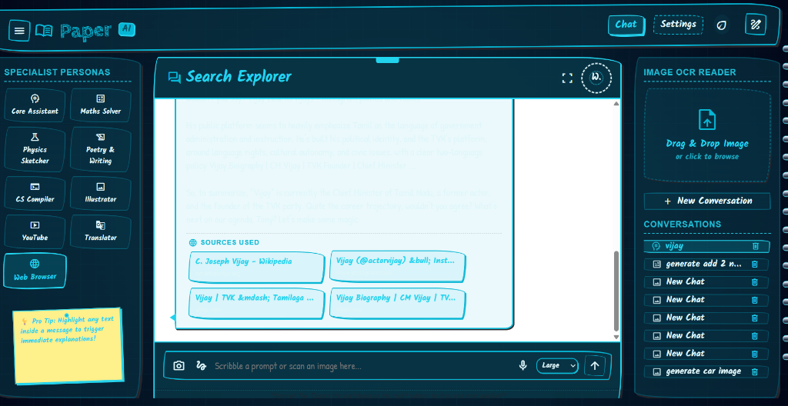

# 📝 Paper — Personal AI Companion (Hand-Drawn Sketchbook Workspace)

<div align="center">

[](LICENSE)
[](https://nodejs.org/)
[](https://paperc.vercel.app)
[](CONTRIBUTING.md)

**Paper** is a production-ready, highly interactive personal AI assistant workspace designed with an authentic, wobbly **Hand-Drawn (Sketchbook)** aesthetic. Built for creators, developers, and thinkers, it rejects cold grids and clinical lines, swapping them for notebook outlines, handwriting typography, paper gradients, masking tape overlays, and offset pencil drop shadows.

[**Live Demo Website**](https://paperc.vercel.app) • [**Report a Bug**](https://github.com/vigneshwaransp/paper/issues) • [**Request Feature**](https://github.com/vigneshwaransp/paper/issues)

</div>

---

## 🎨 Hero Showcase

<div align="center">
  
  <h3>A Spacious Fullscreen Creative Workspace with Curated Specialist Personas</h3>
</div>

---

## ✨ Features

- 🎭 **Curated Specialist Personas:** 9 unique agents including Core Assistant, Maths Solver, Physics Sketcher, Poetry & Writing, CS Compiler, Artistic Illustrator, YouTube Companion, Translator, and Web Browser.
- 🎨 **Visual Themes per Workspace:** Switch personas to see the environment morph dynamically—e.g. Chalkboard green for Maths/Physics, vintage Sepia for English, retro terminal black for CS Compiler, and cyber cyan for Web Browser.
- 🔍 **Web Search Integration:** Real-time web scraping and search powered by Yahoo! Search. Synthesizes organic search results dynamically.
- 🗂️ **Interactive Source Citation Cards:** Displays styled, clickable card panels for references and sources used during web scraping, with smart HTML entity decoding.
- 📜 **Inline Markdown Citations:** Automatically formats and highlights references (`[1]`, `[Source 1]`) in the chat stream.
- 👁️ **OCR Sketch Scanner (Image-to-Text):** Drag and drop or snap handwritten drawings/documents to extract text instantly via client-side Tesseract.js.
- 🎙️ **Microphone Dictation (Speech-to-Text):** Dictate your commands using your browser's native SpeechRecognition.
- 🗣️ **Text-to-Speech (TTS):** Streams response text aloud using browser-native SpeechSynthesis, supporting customizable speeds and auto-speak switches.
- 🧠 **Local NLP Sentiment Diagnostic:** Evaluates user prompt sentiment to plot a live "Cerebral Mood Index" on the dashboard.
- 💾 **Supabase Database Cloud Sync:** Safely backup and restore your active session history to Supabase PostgreSQL database tables.

---

## 💡 Why Paper is Different?

In a sea of standard Tailwind CSS grids and dark-mode templates, **Paper** focuses on **tactile design and digital skeuomorphism**. Every button resembles a pencil sketch, every modal mimics a piece of masking tape, and every page behaves like a leaf of wobbly notebook paper. It brings fun, personality, and human-like expression to the AI interface.

---

## 🛠️ Folder Structure

```text
├── .github/                  # GitHub Actions workflow & issue/PR templates
│   ├── ISSUE_TEMPLATE/       # Templates for Bug, Feature, and Question
│   └── PULL_REQUEST_TEMPLATE.md
├── api/                      # Serverless backend functions (Vercel)
│   ├── backup.js             # Session save to PostgreSQL db
│   ├── restore.js            # Session load from PostgreSQL db
│   ├── completion.js         # Backend LLM completions proxy
│   └── search.js             # Yahoo Search scraping backend proxy
├── index.html                # Main Home Dashboard HUD page
├── chat.html                 # Chat/Workspace container page
├── settings.html             # Identity and Tune Console settings page
├── app.js                    # Frontend Dashboard script
├── chat.js                   # Frontend Chat core handler
├── settings.js               # Frontend settings controller
├── common.js                 # Shared UI state parameters and local storage utils
├── server.js                 # Local companion Node.js server
├── db.js                     # PostgreSQL client initialization
├── style.css                 # Master Hand-Drawn Design System stylesheet
├── vercel.json               # Vercel platform configurations
├── package.json              # Project dependencies and script runner
└── .env.example              # Placeholder keys configuration
```

---

## ⚙️ Configuration & Environment Variables

Paper operates with a **"Bring Your Own API Key"** architecture. To customize and run the server, copy `.env.example` to `.env` and fill in the following:

| Environment Variable | Description | Example / Details |
| --- | --- | --- |
| `DATABASE_URL` | Supabase PostgreSQL connection string for backup sync | `postgresql://postgres:...` |
| `FRIDAY_API_KEY` | Default API key for OpenRouter models | `sk-or-v1-...` |
| `FRIDAY_NVIDIA_API_KEY`| API key for NVIDIA NIM completions | `nvapi-...` |
| `FRIDAY_MISTRAL_API_KEY`| API key for Mistral AI models | `6optH...` |
| `FRIDAY_DB_KEY` | Sync passphrase to prevent unauthorised backup restores | `custom_passphrase` |

---

## 🚀 Running Locally

Paper can be run with zero setup as a static file workspace or with the companion server.

### Option 1: Static File Setup (Direct Flow)
Since all pages use native standard scripts, you can run Paper **locally without any server**:
1. Double-click `index.html` in your favorite web browser.
2. Configure your keys directly in the **Neural Alignment Console** (Settings) tab.

### Option 2: Companion Node Server
For backend-assisted search queries and cloud database backup sync:
1. Clone the repository and install dependencies:
   ```bash
   npm install
   ```
2. Start the local host server:
   ```bash
   npm start
   ```
3. Open your browser and navigate to:
   ```text
   http://localhost:3000
   ```

---

## 📦 Deployment Guide

### Deploying to Vercel
Paper is configured for Vercel out of the box. The serverless functions in the `/api` directory will spin up automatically.
1. Install Vercel CLI:
   ```bash
   npm install -g vercel
   ```
2. Deploy directly:
   ```bash
   vercel --prod
   ```
3. Set your environment variables (`FRIDAY_NVIDIA_API_KEY`, etc.) inside the Vercel Dashboard project settings.

---

## 🧠 Supported AI Providers

Paper lets you swap models on the fly. Configure these credentials in your Settings console or environment:
* **OpenRouter:** Connects to standard models like `meta-llama/llama-3.3-70b-instruct` or any free model fallback.
* **NVIDIA NIM:** Connects to high-performance inference APIs.
* **Mistral AI:** Connects to Mistral API endpoints (`mistral-large`, etc.).
* **Google Gemini:** Runs client-side or serverless API completion models.

---

## 🗺️ Roadmap

- [ ] **Dockerization:** Create lightweight Docker files for one-step containerized deployment.
- [ ] **Custom Personas:** Enable creating, exporting, and sharing custom workspaces.
- [ ] **Markdown Mathjax:** Full LaTeX math formula rendering inside chat bubbles.
- [ ] **Export Options:** Export chat logs to Markdown, PDF, or raw JSON.

---

## ❓ FAQ

**Q: Do I need a database to use Paper?**  
No, the database is fully optional. If `DATABASE_URL` is omitted, Paper will fallback to browser `localStorage` to persist session histories locally.

**Q: Where are my API keys saved?**  
If entered via the Settings console UI, they are kept securely in your browser's private `localStorage`. If entered on the server, they are resolved via the backend environment variables.

---

## 📄 License

Distributed under the MIT License. See [LICENSE](LICENSE) for more details.

---

## 🤝 Credits

- **Design Aesthetic:** Hand-drawn components inspired by sketches, chalkboard art, and Skeuomorphic workspaces.
- **OCR Reader:** Powered by the open-source [Tesseract.js](https://github.com/naptha/tesseract.js) engine.
